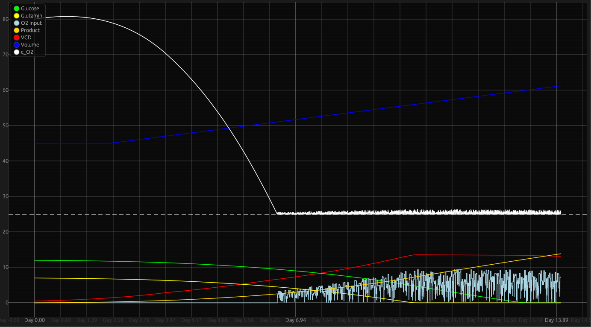

# Visualization panel

## Viewing data

You can view specific data by ***`hovering`***  over the wanted data point.

## Navigation

***`double left clicking`*** resets the plot to the default position.

### Moving around the plot

You can move around the graph using ***`scroll-wheel`*** for `y` axis and ***`shift + scroll-wheel`*** for the `x` axis.
It should support touch gestures, and trackpad gestures.

### Zooming

You are able to zoom in and out by using ***`ctrl + scroll-wheel`*** or by using touch gestures on interfaces that support them.

***`holding right mouse button`*** and selecting an area, zooms into that area.

